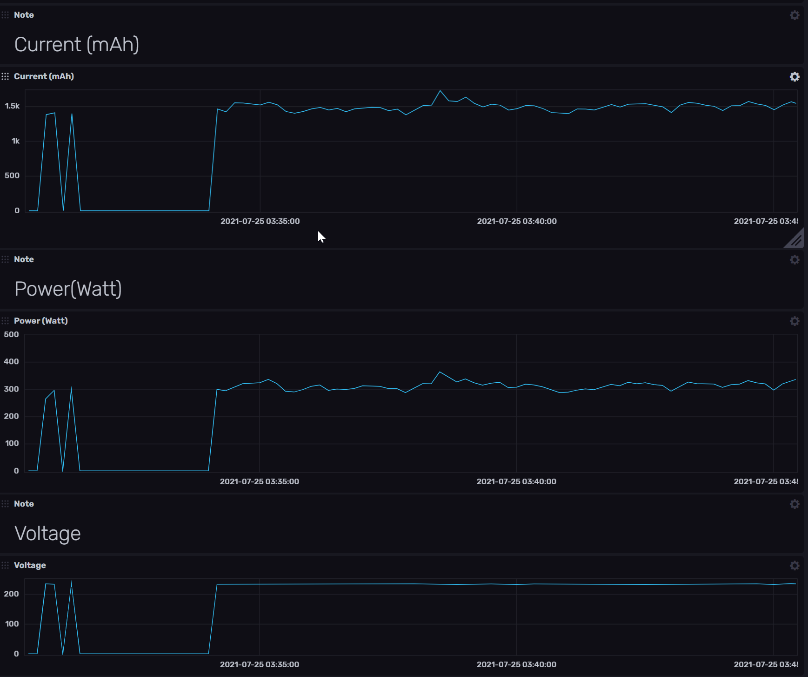

# Tuya Smart Socket Data Capture & Uploader

This script can download data from Tuya Smart Socket device and upload them to a database. Right now it's only using InfluxDB and AWS DynamoDB and only uploading Electricity related data.

Later you can plot this data using InfluxDB or Grafana.

## Library Used

* [tinytuya](https://github.com/jasonacox/tinytuya)
* [boto3](https://github.com/boto/boto3)
* [influxdb-client](https://github.com/influxdata/influxdb-python)